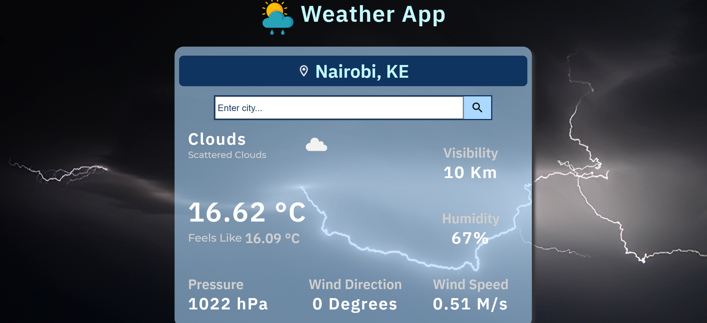

# Weather App with JS, Webpack & OpenWeatherMap API

This app is built with JS, HTML, CSS, Open Weather Map Api and webpack for module bundling.

* View live [Demo](https://regan-mu.github.io/weather-app/)

